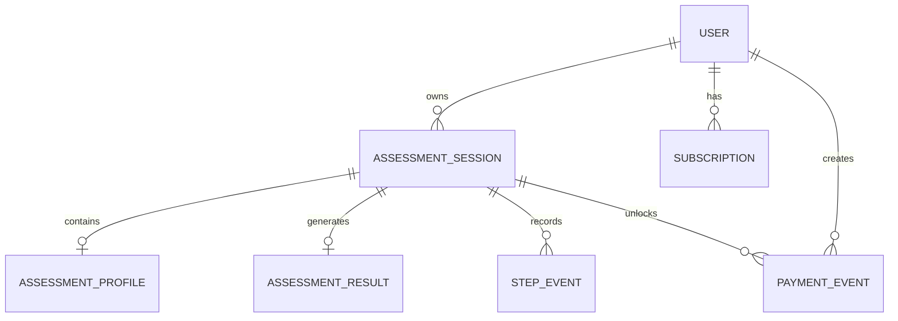

# Health Assessment Funnel

[简体中文](README.zh-CN.md) · **English** · [AI Quickstart](docs/en/AI_QUICKSTART.md) · [Documentation](docs/en/README.md)

[](https://github.com/JetSprow/health-assessment-funnel/actions/workflows/ci.yml)

A full-stack health-assessment funnel built for a three-day engineering challenge. Anonymous users complete a seven-step questionnaire, resume interrupted progress, receive a server-generated assessment, see a redacted result before payment, and unlock the complete report through an idempotent Mock payment flow.

> The calculation rules are for technical demonstration and general wellness education only. They are not medical advice or diagnosis.

## Live demo

- Application: <http://82.22.31.80>
- Health probe: <http://82.22.31.80/api/health>
- GitHub: <https://github.com/JetSprow/health-assessment-funnel>
- First deployment: 2026-07-15

The acceptance environment currently uses HTTP on a server IP. It is suitable for fictional demo data only. Before collecting real data, configure a domain and HTTPS, then set `COOKIE_SECURE=true`.

### Fast acceptance path

- Replay the full locked → `/pay` → full flow: `./scripts/demo-flow.sh`
- Prepaid test `sessionId`: `64c41d64-1b86-4be9-b3be-f42a9b456dac`
- Demo Cookie, direct cURL and expected response: [Demo and Replay Guide](docs/en/DEMO.md)

Because the application enforces Session ownership, a `sessionId` alone cannot read a result. The documented demo Cookie intentionally authenticates only fictional acceptance data.

## Completed user journey

1. Create an anonymous User and Assessment Session; issue an HttpOnly Cookie.
2. Collect gender, goal, age, height, current weight, target weight and activity level.
3. Persist every step incrementally and restore progress after refresh.
4. Handle retries, reused idempotency keys, stale versions and concurrent writes.
5. Calculate BMI, BMI category, recommended calories, target date and weekly projection on the server.
6. Return an explicit locked DTO to unpaid users without protected values.
7. Activate an idempotent Mock subscription through `POST /api/pay` or `POST /pay`.
8. Return the complete persisted report after payment and preserve access after refresh.

## Technology

- Next.js 16 App Router, React 19 and TypeScript
- Tailwind CSS 4
- Prisma 7 and PostgreSQL 16
- Zod
- Vitest, Testing Library and Playwright
- Docker Compose and Nginx
- GitHub Actions

## Local setup

### 1. Install dependencies

```bash
npm install
cp .env.example .env
```

### 2. Prepare PostgreSQL

Use an existing PostgreSQL instance, update `DATABASE_URL`, then run:

```bash
npm run db:generate
npm run db:push
```

Or start Prisma's local PostgreSQL environment:

```bash
npm run db:local
npm run db:push
```

### 3. Start the application

```bash
npm run dev
```

Open `http://localhost:3000`.

## Commands

```bash
npm run dev            # Development server
npm run lint           # ESLint
npm run typecheck      # TypeScript static check
npm test               # Vitest suite
npm run test:coverage  # Coverage report
npm run test:e2e       # Playwright user journey and real-DB API cases
npm run build          # Production build
npm run db:format      # Format Prisma Schema
npm run db:validate    # Validate Prisma Schema
npm run db:generate    # Generate Prisma Client
npm run db:local       # Start local Prisma PostgreSQL
npm run db:push        # Sync Schema in development
npm run db:migrate     # Create a development migration
npm run db:deploy      # Apply committed migrations
```

Run the complete local quality gate:

```bash
npm run db:validate && \
npm run lint && \
npm run typecheck && \
npm test && \
npm run build && \
npm run test:e2e && \
npm audit --audit-level=high
```

## API summary

All successful responses use `{ data, meta: { requestId } }`. Errors use `{ error, meta: { requestId } }`.

### Create a Session

```http
POST /api/sessions
```

Creates an anonymous User and Session and sets a 30-day HttpOnly, SameSite=Lax Cookie. PostgreSQL stores only a SHA-256 hash of the anonymous token.

### Save one step

```http
PATCH /api/sessions/:sessionId/steps/:stepKey
Content-Type: application/json

{
  "requestId": "gender-unique-request-id",
  "version": 0,
  "data": { "gender": "FEMALE" }
}
```

Supported keys:

```text
gender | goal | age | height | weight | target-weight | activity
```

- Exact replay: `200`, `duplicated: true`.
- Same key with a different step or payload: `409 IDEMPOTENCY_CONFLICT`.
- A new request with a stale version: `409 VERSION_CONFLICT`.
- Every payload uses a strict Zod Schema and rejects extra or out-of-range fields.

### Restore progress

```http
GET /api/sessions/:sessionId/progress
```

Returns the persisted Profile, highest reached step and latest optimistic version for the authenticated owner.

### Submit the assessment

```http
POST /api/sessions/:sessionId/submit
Content-Type: application/json

{ "version": 7 }
```

Validates the complete Profile and persists the versioned calculation in a transaction.

### Read the result

```http
GET /api/sessions/:sessionId/result
```

Locked response:

```json
{
  "access": "LOCKED",
  "subscriptionStatus": "INACTIVE",
  "summary": { "bmi": 25.71, "category": "OVERWEIGHT" },
  "lockedSections": ["recommendedCalories", "targetDate", "projectionCurve"]
}
```

An active subscription returns calories, target date, projection curve, cap flag, algorithm version and calculation time.

### Mock payment

```http
POST /api/pay
POST /pay
Content-Type: application/json

{
  "sessionId": "uuid",
  "idempotencyKey": "payment-demo-001"
}
```

Payment event creation and subscription activation run in one transaction. Replaying the same key does not create a second payment.

## Data model



Important decisions:

- `AssessmentProfile` is partially nullable for incremental persistence.
- `AssessmentSession.version` implements optimistic concurrency control.
- `StepEvent` is unique on `(assessmentSessionId, requestId)`.
- `PaymentEvent.idempotencyKey` is globally unique.
- `AssessmentResult` persists the algorithm version and projection.
- Database CHECK constraints complement Zod validation.

## Test coverage

The automated suite covers:

- Normal calculations, maintain-weight behavior, missing inputs, numeric boundaries, NaN/Infinity, conflicting target direction and projection caps.
- Strict incremental Schemas and extra-field rejection.
- Progress restoration and Decimal serialization.
- Exact replay, conflicting keys, stale versions, out-of-order saves and concurrent writes.
- Incomplete submission and completed-Session mutation rejection.
- Protected-field non-disclosure for locked results.
- Payment idempotency and LOCKED → FULL access transition.
- Mobile browser creation, save, refresh, restore, submit, payment, unlock and post-payment refresh.
- Real PostgreSQL API replay, recovery and concurrency behavior.

These tests focus on trust boundaries and state transitions rather than only visual snapshots. Production payment, clinical validation, full browser matrices, load testing and automated disaster-recovery drills remain intentionally outside the challenge scope.

## Production deployment

The repository provides a single-server Docker Compose topology with Nginx, a non-root Next.js standalone runtime, a one-shot Prisma migrator and private PostgreSQL 16.

```bash
git clone https://github.com/JetSprow/health-assessment-funnel.git
cd health-assessment-funnel
cp .env.production.example .env.production
# Replace secrets. Keep COOKIE_SECURE=false only for temporary plain HTTP.

docker compose --env-file .env.production build --pull
docker compose --env-file .env.production up -d
```

See [Dedicated Server Deployment](docs/en/DEPLOYMENT.md) for installation, update, rollback and HTTPS guidance.

## Documentation

- [AI-friendly Quickstart](docs/en/AI_QUICKSTART.md)
- [Documentation Index](docs/en/README.md)
- [Development Plan](docs/en/DEVELOPMENT_PLAN.md)
- [Architecture](docs/en/ARCHITECTURE.md)
- [API Contract](docs/en/API.md)
- [Deployment](docs/en/DEPLOYMENT.md)
- [Operations Runbook](docs/en/OPERATIONS.md)
- [Security Notes](docs/en/SECURITY.md)
- [Testing Strategy](docs/en/TESTING.md)
- [Demo and cURL Replay](docs/en/DEMO.md)
- [Requirements Traceability](docs/en/REQUIREMENTS_TRACEABILITY.md)
- [Submission Checklist](docs/en/SUBMISSION.md)
- [AI Development Retrospective](docs/en/AI_RETROSPECTIVE.md)

## License

MIT. See [LICENSE](LICENSE).
