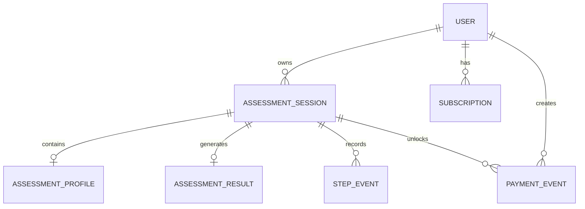

# Health Assessment Funnel

**简体中文** · [English](README.en.md) · [AI 快速上手](docs/zh-CN/AI_QUICKSTART.md) · [文档中心](docs/zh-CN/README.md)

[](https://github.com/JetSprow/health-assessment-funnel/actions/workflows/ci.yml)

一个面向全栈工程挑战的健康测评 Funnel：匿名用户完成七步问卷，进度可中断恢复，由服务端生成评估结果；未订阅用户只能看到脱敏摘要，完成 Mock 支付后可查看完整趋势报告。

> 本项目中的计算规则仅用于技术演示和一般健康教育，不构成医疗建议或诊断。

## 在线演示

- 地址：<http://82.22.31.80>
- GitHub：<https://github.com/JetSprow/health-assessment-funnel>
- 首次部署：2026-07-15
- 状态探针：<http://82.22.31.80/api/health>

当前演示通过服务器 IP 和 HTTP 提供。它适合功能验收，不适合承载真实健康数据；配置域名与 HTTPS 后，应将 `COOKIE_SECURE` 切换为 `true`。

### 验收快速入口

- 一键重放未付费 → `/pay` → 完整结果：`./scripts/demo-flow.sh`
- 已支付测试 `sessionId`：`64c41d64-1b86-4be9-b3be-f42a9b456dac`
- 固定测试 Cookie、直接读取命令和预期响应：[演示与重放指南](docs/zh-CN/DEMO.md)

本实现会验证匿名用户对 Session 的归属，因此固定 `sessionId` 必须与文档中的专用演示 Cookie 配合使用。该凭证只对应虚构测试数据，并被有意公开用于验收。

可直接重放已支付 Session 的 `/pay` 幂等调用：

```bash
SESSION_ID='64c41d64-1b86-4be9-b3be-f42a9b456dac'
DEMO_COOKIE='health_assessment_session=a6a1178c-4eaa-460f-8223-3fb9a7ff4154.ctKrNuC4Bwtm-SFFiOivPz-0rMbTlzA4pCUhTWoioBA'

curl --fail-with-body --silent --show-error \
  -H "Cookie: $DEMO_COOKIE" \
  -H 'Content-Type: application/json' \
  -X POST http://82.22.31.80/pay \
  --data "{\"sessionId\":\"$SESSION_ID\",\"idempotencyKey\":\"public-paid-demo-20260715\"}"
```

若要观察同一个新 Session 从 `LOCKED` 变为 `FULL`，运行 `./scripts/demo-flow.sh`。

## 已完成的用户闭环

1. 创建匿名用户与测评 Session，并下发 HttpOnly Cookie。
2. 完成性别、目标、年龄、身高、当前体重、目标体重、活动水平七个步骤。
3. 每一步增量保存；刷新页面后从数据库恢复答案和版本。
4. 通过请求幂等键与乐观锁处理重复、过期及并发写入。
5. 服务端计算 BMI、BMI 分类、每日建议热量、预计目标日期和逐周趋势。
6. 未订阅用户只能看到 BMI 摘要，受保护字段不会进入公开 DTO。
7. `POST /api/pay` 或 `POST /pay` 完成幂等 Mock 支付并激活订阅。
8. 支付后重新读取结果，完整报告立即解锁，刷新后仍保持会员状态。

## 技术栈

- Next.js 16 App Router、React 19、TypeScript
- Tailwind CSS 4
- Prisma 7、PostgreSQL
- Zod
- Vitest、Testing Library、Playwright
- GitHub Actions

## 本地启动

### 1. 安装依赖

```bash
npm install
cp .env.example .env
```

### 2. 准备 PostgreSQL

使用已有 PostgreSQL，修改 `.env` 中的 `DATABASE_URL`，然后执行：

```bash
npm run db:generate
npm run db:push
```

也可以启动 Prisma 本地 Postgres：

```bash
npm run db:local
npm run db:push
```

### 3. 启动应用

```bash
npm run dev
```

浏览器打开 `http://localhost:3000`。

## 常用命令

```bash
npm run dev            # 本地开发服务器
npm run lint           # ESLint
npm run typecheck      # TypeScript 静态检查
npm test               # Vitest
npm run test:coverage  # 覆盖率报告
npm run test:e2e      # Playwright 完整用户闭环
npm run build          # Next.js 生产构建
npm run db:format      # 格式化 Prisma Schema
npm run db:validate    # 校验 Prisma Schema
npm run db:generate    # 生成 Prisma Client
npm run db:local       # 启动本地 Prisma Postgres
npm run db:push        # 同步 Schema 到开发数据库
npm run db:migrate     # 创建开发迁移
npm run db:deploy      # 部署已提交迁移
```

## API

### 创建 Session

```http
POST /api/sessions
```

创建匿名用户与测评 Session，并设置 30 天有效的 HttpOnly、SameSite=Lax Cookie。数据库只保存匿名 Token 的 SHA-256 Hash。

### 增量保存步骤

```http
PATCH /api/sessions/:sessionId/steps/:stepKey
Content-Type: application/json

{
  "requestId": "gender-unique-request-id",
  "version": 0,
  "data": { "gender": "FEMALE" }
}
```

支持的 `stepKey`：

```text
gender | goal | age | height | weight | target-weight | activity
```

- 相同 `requestId` 与相同 Payload 重放：返回成功，`duplicated: true`。
- 相同 `requestId` 携带不同步骤或 Payload：返回 `409 IDEMPOTENCY_CONFLICT`。
- 不同请求携带旧 `version`：返回 `409 VERSION_CONFLICT`。
- 每一步使用严格 Zod Schema，拒绝越界值和额外字段。

### 恢复进度

```http
GET /api/sessions/:sessionId/progress
```

返回已保存 Profile、最高步骤和最新版本，仅允许 Session 所属匿名用户读取。

### 提交测评

```http
POST /api/sessions/:sessionId/submit
Content-Type: application/json

{ "version": 7 }
```

服务端校验完整 Profile，在同一事务中通过乐观锁完成 Session、计算结果和算法版本的持久化。重复提交已完成 Session 会安全返回 `duplicated: true`。

### 读取结果

```http
GET /api/sessions/:sessionId/result
```

未订阅响应只构造公开 DTO：

```json
{
  "access": "LOCKED",
  "subscriptionStatus": "INACTIVE",
  "summary": { "bmi": 25.71, "category": "OVERWEIGHT" },
  "lockedSections": ["recommendedCalories", "targetDate", "projectionCurve"]
}
```

激活订阅后返回包含建议热量、目标日期、预测曲线与算法版本的完整 DTO。

### Mock 支付

```http
POST /api/pay
POST /pay
Content-Type: application/json

{
  "sessionId": "uuid",
  "idempotencyKey": "payment-demo-001"
}
```

支付事件、订阅激活在同一事务中完成；重复幂等键不会创建第二笔支付。

## 架构与数据模型



关键设计：

- `AssessmentProfile` 字段可空，支持逐步持久化。
- `AssessmentSession.version` 是写入乐观锁。
- `StepEvent` 唯一约束为 `(assessmentSessionId, requestId)`。
- `PaymentEvent.idempotencyKey` 全局唯一。
- `AssessmentResult` 保存 `algorithmVersion`、预测曲线和封顶标志。
- Migration 额外包含年龄、身高、体重、步骤和版本的数据库 CHECK 约束。

完整定义见 `prisma/schema.prisma` 和 `prisma/migrations/`。

## 测试覆盖

自动化测试覆盖：

- 算法正常路径、维持体重、缺失字段、年龄/身高/体重上下界、NaN/Infinity、目标方向冲突、超长预测封顶。
- 分步 Schema 严格字段和数值边界。
- 进度恢复及 Decimal 的 JSON 安全转换。
- 重复保存、幂等键冲突、旧版本冲突、乱序保存、并发写入。
- 不完整 Profile 禁止提交和已完成 Session 禁止继续修改。
- 未付费 DTO 受保护字段防泄漏。
- Mock 支付幂等性及付费前后结果访问切换。
- 移动端真实浏览器中的创建、填写、刷新恢复、提交、解锁和付费后刷新。
- 真实 PostgreSQL 上的 API 重放、乱序保存、恢复和并发版本竞争。

### 为什么覆盖这些场景

测试优先覆盖系统的信任边界和状态转换：客户端输入不能直接可信；分步写入会遇到重试、乱序和并发；结果接口必须证明受保护字段没有被序列化；支付必须同时证明幂等和权限状态持久化。它们比单纯扩大页面快照数量更能直接证明挑战要求中的后端正确性。

### 暂未覆盖及原因

- 真实支付网关、签名 Webhook、退款和对账：挑战明确要求 Mock 支付，生产支付需要独立合规设计。
- 临床有效性和医疗法规验证：当前算法仅为工程演示，不构成医疗建议。
- Safari/Firefox 全矩阵和大规模负载测试：三天挑战优先保证 Chromium 移动端主链路与核心后端边界；上线前应补浏览器兼容、容量和长稳测试。
- 自动化灾备恢复演练：已经提供每日备份与恢复手册，但正式生产前仍需在隔离环境做周期性恢复演练。

CI 在 Push 和 Pull Request 时执行依赖安装、Lint、类型检查、Vitest、生产构建，并在 PostgreSQL 服务上运行 Playwright 端到端测试。详细策略见 [测试策略](docs/zh-CN/TESTING.md)。

## 生产部署

仓库提供 Docker Compose 单机生产拓扑：Nginx、Next.js Standalone、一次性 Prisma Migration 和私有 PostgreSQL 16。数据库端口不会暴露到公网。

```bash
git clone https://github.com/JetSprow/health-assessment-funnel.git
cd health-assessment-funnel
cp .env.production.example .env.production
# 修改生产数据库密码；HTTP/IP 临时部署保持 COOKIE_SECURE=false

docker compose --env-file .env.production build --pull
docker compose --env-file .env.production up -d
```

完整步骤、升级与回滚说明见 [专用服务器部署](docs/zh-CN/DEPLOYMENT.md)。

## 完整文档索引

- [AI 友好快速上手](docs/zh-CN/AI_QUICKSTART.md)
- [文档中心](docs/zh-CN/README.md)
- [详细开发计划](docs/zh-CN/DEVELOPMENT_PLAN.md)
- [系统架构](docs/zh-CN/ARCHITECTURE.md)
- [API 契约](docs/zh-CN/API.md)
- [专用服务器部署](docs/zh-CN/DEPLOYMENT.md)
- [运维手册](docs/zh-CN/OPERATIONS.md)
- [安全说明](docs/zh-CN/SECURITY.md)
- [测试策略](docs/zh-CN/TESTING.md)
- [验收与 cURL 重放](docs/zh-CN/DEMO.md)
- [要求追踪矩阵](docs/zh-CN/REQUIREMENTS_TRACEABILITY.md)
- [提交邮件模板与检查清单](docs/zh-CN/SUBMISSION.md)
- [AI 协作复盘](docs/zh-CN/AI_RETROSPECTIVE.md)

## 许可证

MIT，详见 [LICENSE](LICENSE)。
