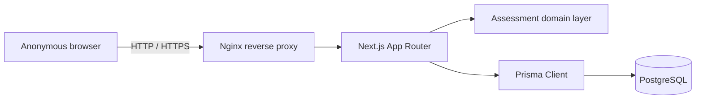
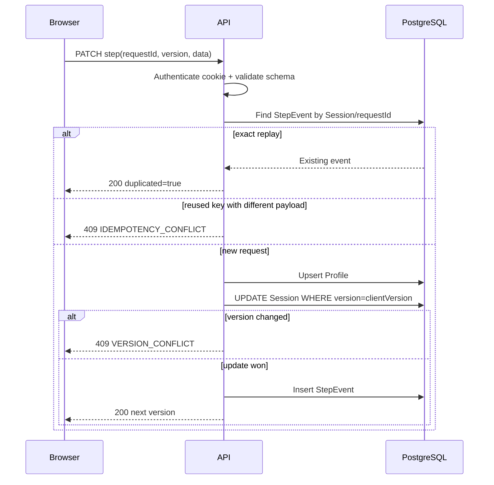
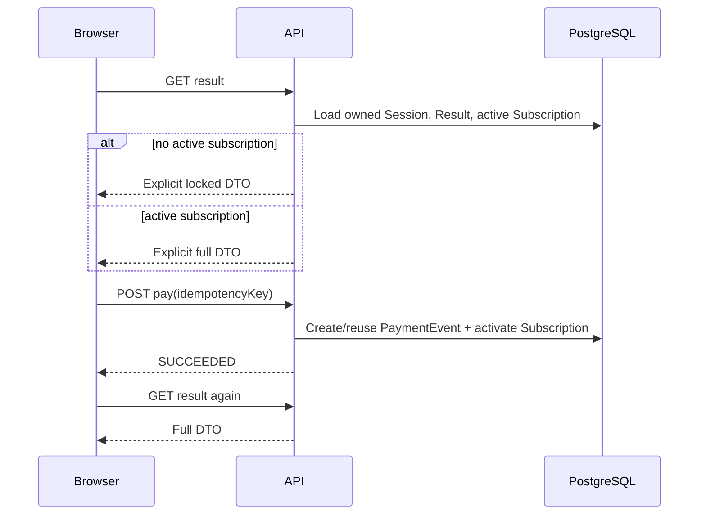
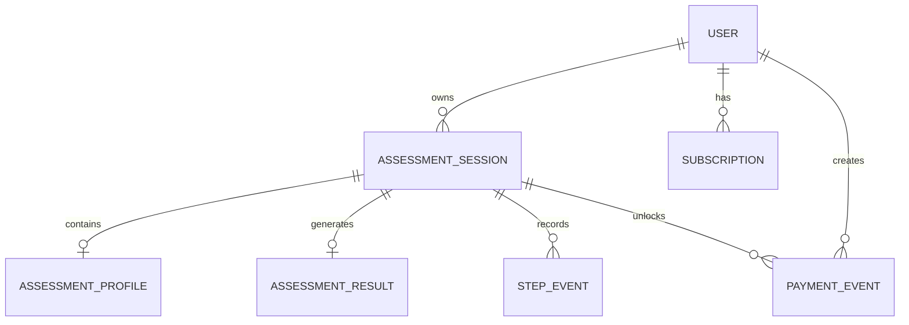

[简体中文](../zh-CN/ARCHITECTURE.md) · **English** · [Documentation Index](README.md)

# Architecture

## System context



The application is intentionally a modular monolith. The three-day challenge does not need distributed services; transactional boundaries, deployment simplicity and testability are more valuable than early service decomposition.

## Application layers

```text
src/app/                         Routes and UI
src/app/api/                     HTTP Route Handlers
src/domain/assessment/           Validation, algorithm and access DTOs
src/server/                      Database, anonymous auth and API helpers
prisma/                          Schema and versioned migrations
tests/unit/                      Domain and Route Handler tests
tests/e2e/                       Browser-level user journey
```

### UI layer

- Landing page and anonymous Session creation.
- Seven-step, one-question-at-a-time Funnel.
- Progress restoration and 409 conflict recovery.
- Locked and full result states.
- Mock payment transition.

### API layer

Route Handlers own authentication, request parsing, status codes and transaction orchestration. They do not contain presentation logic.

### Domain layer

- `assessment.schema.ts`: complete and incremental Zod contracts.
- `assessment.algorithm.ts`: deterministic versioned calculation.
- `result-access.ts`: explicit public/full serialization paths.

### Persistence layer

Prisma maps the relational model and migrations. PostgreSQL constraints complement application validation.

## Core sequences

### Incremental save



### Result access and payment



## Data model



## Key decisions

1. **Anonymous Token Hash**: the raw credential remains only in an HttpOnly Cookie.
2. **Optimistic Session Version**: prevents silent multi-tab overwrites without database row locks across the whole Funnel.
3. **Step Event Idempotency**: retry-safe command processing and auditability.
4. **Explicit Result DTOs**: protected fields are never serialized for unpaid users.
5. **Algorithm Versioning**: persisted results remain auditable if calculation rules change.
6. **Docker Compose Deployment**: a reproducible app, migration, proxy and database topology for a single dedicated server.
