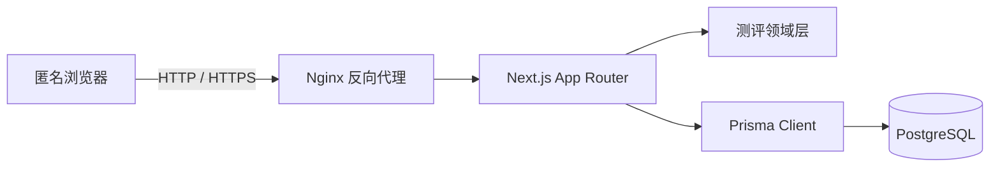
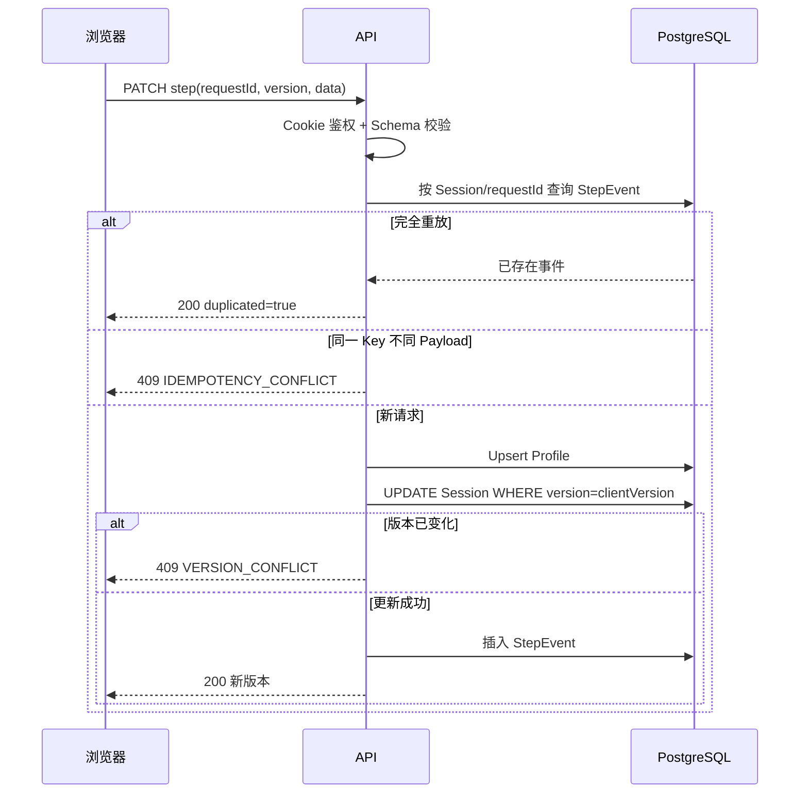
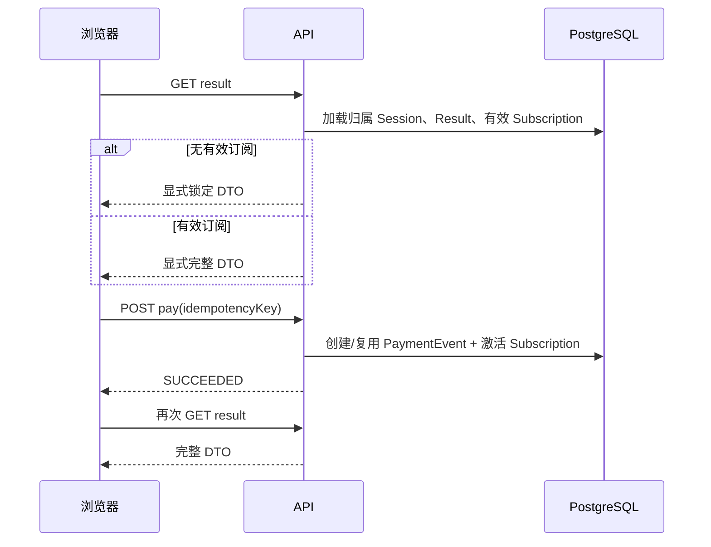
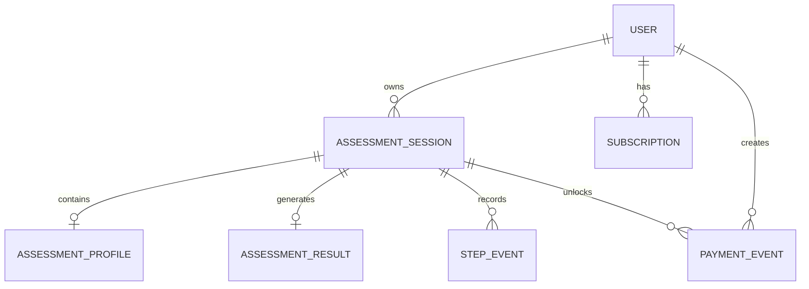

**简体中文** · [English](../en/ARCHITECTURE.md) · [文档中心](README.md)

# 系统架构

## 系统上下文



应用有意采用模块化单体。三天挑战不需要分布式服务；清晰的事务边界、部署简单性和可测试性比过早拆分服务更重要。

## 应用分层

```text
src/app/                         路由与 UI
src/app/api/                     HTTP Route Handlers
src/domain/assessment/           校验、算法和访问 DTO
src/server/                      数据库、匿名鉴权和 API 工具
prisma/                          Schema 与版本化 Migration
tests/unit/                      领域和 Route Handler 测试
tests/e2e/                       浏览器级用户旅程
```

### UI 层

- 落地页与匿名 Session 创建。
- 七步、一次一题的 Funnel。
- 进度恢复和 409 冲突恢复。
- 锁定与完整结果状态。
- Mock 支付状态切换。

### API 层

Route Handler 负责鉴权、请求解析、状态码和事务编排，不承载展示逻辑。

### 领域层

- `assessment.schema.ts`：完整与增量 Zod 契约。
- `assessment.algorithm.ts`：确定性的版本化计算。
- `result-access.ts`：显式公开/完整序列化路径。

### 持久化层

Prisma 映射关系模型和 Migration，PostgreSQL 约束作为应用校验的第二道边界。

## 核心时序

### 增量保存



### 结果权限与支付



## 数据模型



## 关键决策

1. **匿名 Token Hash**：原始凭证只保留在 HttpOnly Cookie。
2. **Session 乐观版本**：无需在整个 Funnel 上持有数据库行锁，也能防止多标签页静默覆盖。
3. **步骤事件幂等**：支持安全重试并保留审计能力。
4. **显式结果 DTO**：未付费用户永远不会收到受保护字段。
5. **算法版本化**：计算规则变化后，已持久化结果仍可审计。
6. **Docker Compose 部署**：为单台专用服务器提供可复现的应用、迁移、代理和数据库拓扑。
